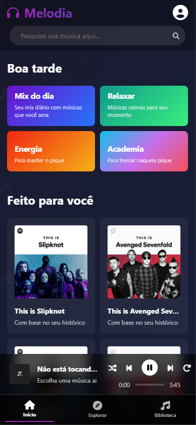
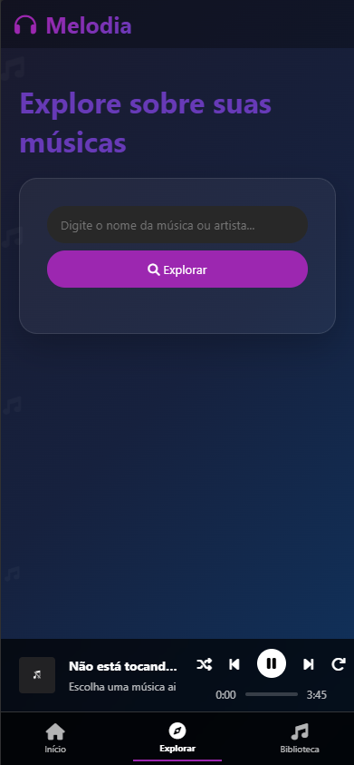
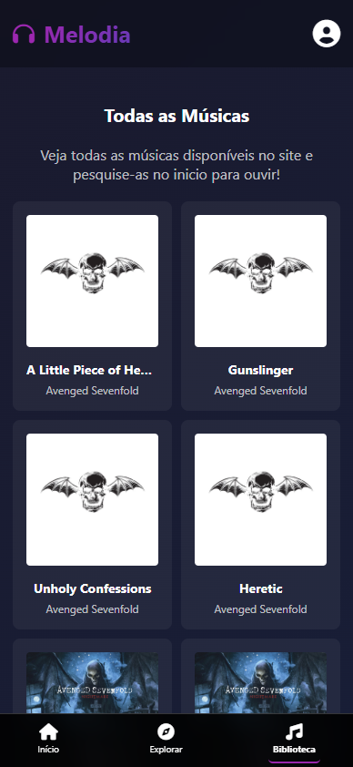
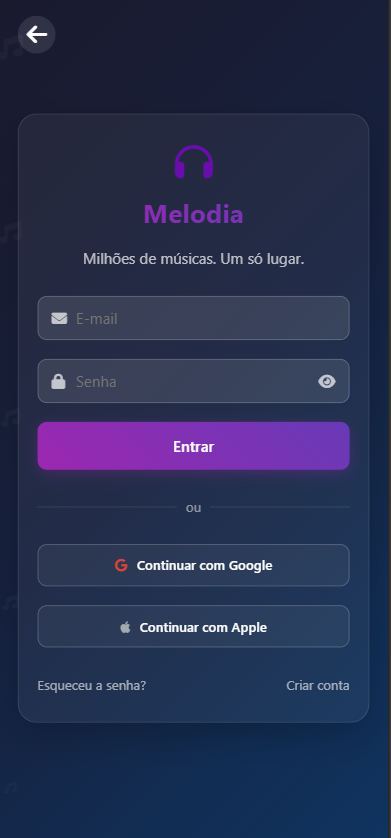

# Melodia 🎵

Plataforma de streaming de música desenvolvida como projeto escolar na disciplina de Programação Mobile. O **Melodia** permite que usuários explorem, pesquisem e escutem músicas de maneira simples e intuitiva, contando com integração à API do Spotify e autenticação via Firebase.

---

## ✨ Funcionalidades Principais

- **Navegação Intuitiva:** Barra de navegação para acesso rápido às seções principais: Início, Explorar e Biblioteca.
- **Pesquisa Inteligente:** Busca por músicas e artistas em tempo real utilizando a API do Spotify.
- **Playlists Personalizadas:** Recomendações automáticas baseadas no histórico do usuário e possibilidade de criar playlists próprias.
- **Reprodutor Integrado:** Player de música embutido para escutar faixas diretamente no site.
- **Visualização de Artistas e Playlists:** Modais exibem informações detalhadas e permitem reprodução imediata das músicas selecionadas.
- **Autenticação de Usuários:** Login via Firebase, garantindo recursos personalizados a cada usuário.

---

## 🗂️ Estrutura do Projeto

O sistema é composto por diferentes páginas, cada uma com uma função específica:

- **Home:** Destaques e playlists recomendadas.
- **Biblioteca:** Acesso ao catálogo completo de músicas disponíveis.
- **Explorar:** Busca e descoberta de músicas e artistas.
- **Login:** Tela de autenticação de usuários.

---

## 📸 Demonstrações (Capturas de Tela)

- **Página Inicial:**  

- **Biblioteca:**  

- **Explorar:**  

- **Login:**  

---

## 🛠️ Tecnologias Utilizadas

- **HTML5:** Estrutura das páginas.
- **CSS3:** Estilização responsiva.
- **JavaScript:** Lógica e interatividade.
- **API do Spotify:** Busca e reprodução de músicas.
- **Firebase:** Autenticação de usuários.

---

## 🚀 Como Visualizar o Projeto

1. Acesse: [trabalhomobile.netlify.app](http://trabalhomobile.netlify.app/)  
2. Faça login para acessar funcionalidades personalizadas.

---

## 👨‍💻 Equipe Desenvolvedora

- Bryan Kauan
- Ana Roberta
- Mayara Tsuchida
- Leodair Erik
- Lucas Cerqueira

---

> Projeto desenvolvido para fins educacionais – Programação Mobile.

